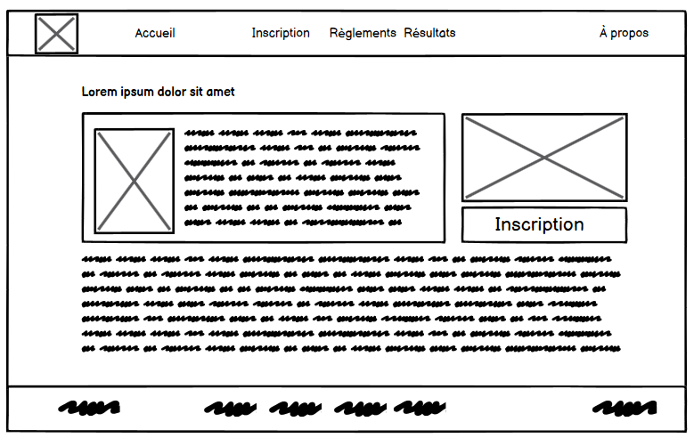
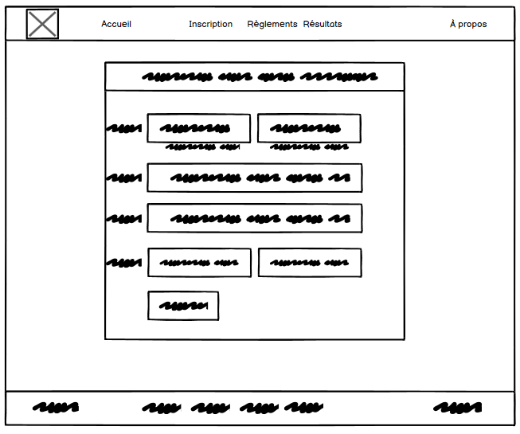

> **Cours:** 420-227-RK
>
> **Étudiant**: Raphael Arseneault

# Laboratoire 5 - Concours de jeux vidéos

## Choix du Sujet

Le sujet du Laboratoire 5 est un concours dans le jeu GTA 5 où le but est de choisir une équipe, soit l’équipe des Héros, soit l’équipe des vilains. Vous incarnerez un personnage policier ou bandit qui devra effectuer les tâches illégales. Les policiers devront mettre en œuvre des stratégies pour arrêter les bandits soit par la force en utilisant des armes, soit par des méthodes plus conventionnelles. Ce Laboratoire consiste à créer un site web qui permettra au joueur de s’inscrire à cet événement.

## Planification du contenu

Navigation: Comprend des onglets pour “Accueil”, “Inscription”, “Règlements”, “Résultats” et “À propos”.

Contenu: Deux sections principales avec des espaces réservés pour des images et du texte de remplissage “Lorem ipsum”.

Fonctionnalité: Un bouton “Inscription” est présent, suggérant une interaction utilisateur pour s’inscrire à un événement ou service.

Design: L’aspect général est épuré, avec une disposition qui favorise une expérience utilisateur intuitive.

Ce prototype est une mise en page d'une présentation permettant d'apporter des informations utiles à l'inscription d'un concours de jeux vidéo.

Ce formulaire sert à recueillir des informations sur les utilisateurs qui souhaitent s’inscrire et participer aux concours proposés par la page de présentation. Il est conçu pour être simple et convivial, facilitant ainsi le processus d’inscription pour les nouveaux membres.

Ce prototype démontre la disposition des différentes parties du formulaire qui seront utilisées pour récupérer les informations du formulaire. 

## Sources du texte et des images

GTA V Logo PNG HD Image - PNG All | PNG ALL. (n.d.). https://www.pngall.com/gta-v-png/download/53651

Png - Gta V Character Png,Gta V Transparent - free transparent png images - pngaaa.com. (n.d.). https://www.pngaaa.com/detail/542698

R.27fcebea94efe035afe207dfb585b083 (1920×1080). (n.d.). https://th.bing.com/th/id/R.27fcebea94efe035afe207dfb585b083?rik=ddt0wO9WLf2VfQ&riu=http%3a%2f%2fvignette4.wikia.nocookie.net%2fgtawiki%2fimages%2fb%2fb1%2fPoliceCruiser2-GTAV-front.png%2frevision%2flatest%3fcb%3d20151213211707&ehk=yLynQeVZ2aVnWLCaBfXJqZQM4%2bPWMemVr1jpFj%2buhrU%3d&risl=1&pid=ImgRaw&r=0

Utilisation de gpt pour la génération du texte sur le site web. 

> Tu peux utiliser le site [Bibliographie (scribbr.fr)](https://www.scribbr.fr/references/generateur/dossier/1h8fJku6npJu6i0FAWpc6k/listes/gy0v0i2jfIlCLbgKD5A3e/) pour générer tes sources dans un format uniforme. Le format `Normes de citation de Harvard, Français` est très bien.
